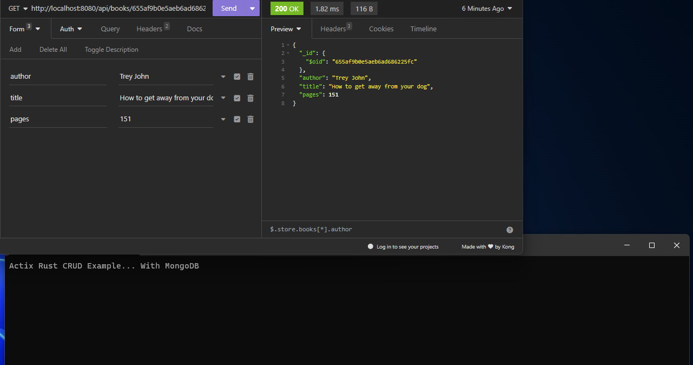

## Actix Rust MongoDB Crud Example

## Usage

You will need rust and mongodb installed locally on your pc. 

- Clone the repo. 
- Cargo run. 
- Use Postman or Insomnia to test routes and get, put, delete, create books.

## Thanks

I'm still learning Rust so there are things that may need refactoring, done differently. If you spot something that could be improved please open an issue. Thanks! 
